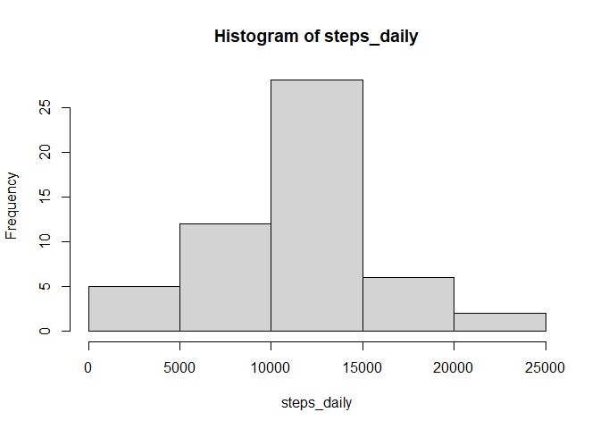
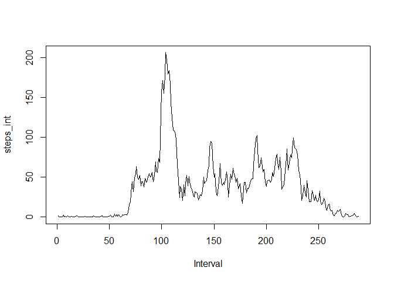
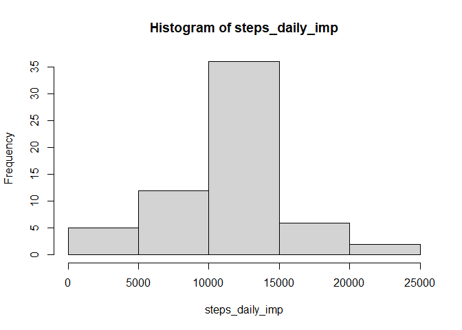
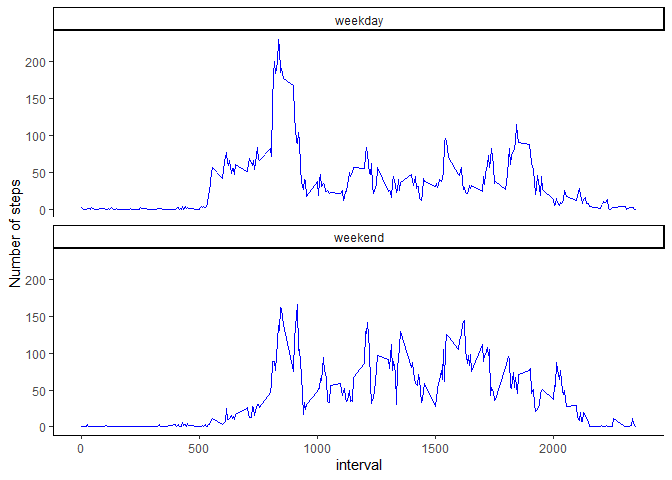

## Loading and preprocessing the data

```r
library(ggplot2)
library(dplyr)
```


```r
data <- read.csv(unz("activity.zip", "activity.csv"), header = T)
data$date <- as.Date(data$date)
```

## What is mean total number of steps taken per day?

```r
# sum steps for each date
steps_daily <- tapply(data$steps, data$date, sum)

# create histogram
hist(steps_daily)
```

<!-- -->

```r
# mean and median
summary(steps_daily)
```

```
##    Min. 1st Qu.  Median    Mean 3rd Qu.    Max.    NA's 
##      41    8841   10765   10766   13294   21194       8
```

## What is the average daily activity pattern?

```r
# calculate average across intervals
steps_int <- tapply(data$steps, data$interval, mean, na.rm = T)

# plot it 
ts.plot(steps_int, type = "l", xlab = "Interval")
```

<!-- -->

```r
# which interval has most steps on av? 
names(steps_int)[which.max(steps_int)]
```

```
## [1] "835"
```

## Imputing missing values

```r
# how many missings? 
sum(is.na(data$steps))
```

```
## [1] 2304
```

```r
# fill in NA's with mean of interval and create new data frame
data2 <- data
data2$steps_m <- tapply(data2$steps, data2$interval, mean, na.rm = T)
data2$steps_imp <- ifelse(is.na(data2$steps), data2$steps_m, data2$steps)
sum(is.na(data2$steps_imp))
```

```
## [1] 0
```

```r
# sum steps for each date
steps_daily_imp <- tapply(data2$steps_imp, data2$date, sum)

# create histogram
hist(steps_daily_imp)
```

<!-- -->

```r
# mean and median
summary(steps_daily_imp)
```

```
##    Min. 1st Qu.  Median    Mean 3rd Qu.    Max. 
##      41    9819   10766   10766   12811   21194
```

```r
# compare with non-imputed data
summary(steps_daily)          # mean and medium are same
```

```
##    Min. 1st Qu.  Median    Mean 3rd Qu.    Max.    NA's 
##      41    8841   10765   10766   13294   21194       8
```

```r
# impact total daily number of steps: more total steps, no missings
sum(steps_daily, na.rm = T)
```

```
## [1] 570608
```

```r
sum(steps_daily_imp, na.rm = T)
```

```
## [1] 656737.5
```

## Are there differences in activity patterns between weekdays and weekends?

```r
# create variable weekday or weekend
data2$day <- weekdays(data2$date)
data2$wknd <- ifelse(data2$day %in% c("zaterdag", "zondag"), "weekend", "weekday")
data2$wknd <- as.factor(data2$wknd)

# plot weekday versus weekend
steps_daily_imp_week <- tapply(data2$steps_imp[data2$wknd =="weekday"],
                               data2$date[data2$wknd =="weekday"], mean)
head(steps_daily_imp_week)
```

```
## 2012-10-01 2012-10-02 2012-10-03 2012-10-04 2012-10-05 2012-10-08 
##   37.38260    0.43750   39.41667   42.06944   46.15972   37.38260
```

```r
steps_daily_imp_weekend <- tapply(data2$steps_imp[data2$wknd =="weekend"],
                                  data2$date[data2$wknd =="weekend"], mean)

# using ggplot
g <- data2 %>% select(steps_imp, interval, wknd) %>% 
    group_by(interval, wknd) %>% 
    mutate(mean_steps_imp = mean(steps_imp, na.rm = T)) %>% 
    ungroup %>% 
    ggplot(., aes(interval, mean_steps_imp)) + 
    facet_wrap(~ wknd, ncol = 1) +
    geom_line(color = "blue") +
    ylab("Number of steps") +
    theme_classic()
g
```

<!-- -->


